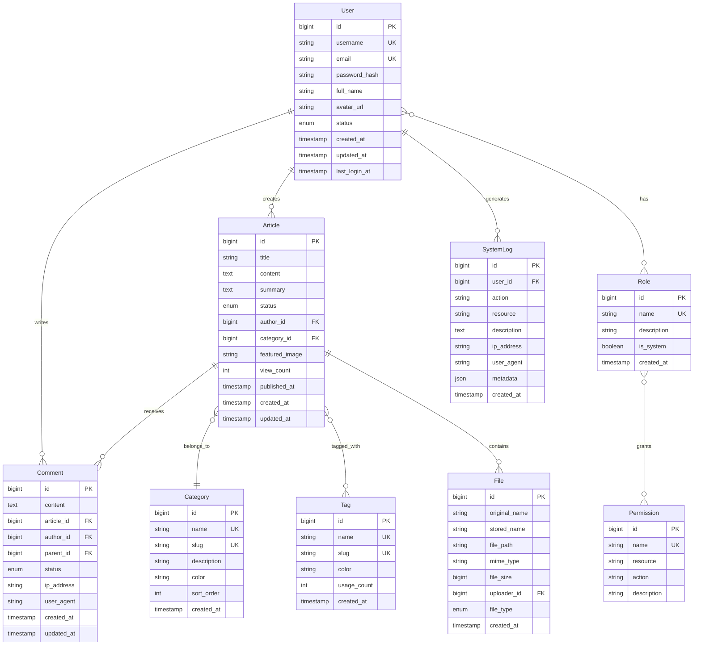

# 博客管理系统设计文档

## 概述

本设计文档基于需求文档，详细描述了博客管理系统扩展功能的技术架构、数据模型、组件设计和实现方案。系统将在现有RESTful博客系统基础上，添加完整的用户认证、权限管理、后台管理等企业级功能。

## 系统架构

### 整体架构图

```
┌─────────────────────────────────────────────────────────────┐
│                    前端层 (Frontend)                        │
├─────────────────────┬───────────────────────────────────────┤
│   用户前台界面        │        管理后台界面                    │
│   - 文章浏览         │        - 用户管理                     │
│   - 用户登录         │        - 文章管理                     │
│   - 评论互动         │        - 系统监控                     │
└─────────────────────┴───────────────────────────────────────┘
                              │
                    ┌─────────┴─────────┐
                    │   API网关层        │
                    │   - 认证拦截       │
                    │   - 权限验证       │
                    │   - 请求路由       │
                    └─────────┬─────────┘
                              │
┌─────────────────────────────┴─────────────────────────────┐
│                    应用服务层                              │
├─────────────┬─────────────┬─────────────┬─────────────────┤
│  用户服务    │   文章服务   │   评论服务   │    文件服务      │
│  - 认证     │   - CRUD    │   - CRUD    │    - 上传       │
│  - 授权     │   - 状态管理 │   - 审核    │    - 管理       │
│  - 角色管理  │   - 分类标签 │   - 通知    │    - 安全检查    │
└─────────────┴─────────────┴─────────────┴─────────────────┘
                              │
┌─────────────────────────────┴─────────────────────────────┐
│                    数据访问层                              │
├─────────────┬─────────────┬─────────────┬─────────────────┤
│  用户仓储    │   文章仓储   │   评论仓储   │    文件仓储      │
│  - JPA      │   - JPA     │   - JPA     │    - JPA        │
│  - 缓存     │   - 缓存    │   - 缓存    │    - 本地存储    │
└─────────────┴─────────────┴─────────────┴─────────────────┘
                              │
┌─────────────────────────────┴─────────────────────────────┐
│                    数据存储层                              │
├─────────────┬─────────────┬─────────────┬─────────────────┤
│   MySQL     │    Redis    │  文件系统    │    日志文件      │
│   - 主数据   │   - 缓存    │   - 上传文件 │    - 操作日志    │
│   - 事务    │   - 会话    │   - 静态资源 │    - 错误日志    │
└─────────────┴─────────────┴─────────────┴─────────────────┘
```

### 技术栈选择

#### 后端技术栈
- **Spring Boot 3.2.0** - 主框架
- **Spring Security 6.x** - 安全框架
- **Spring Data JPA** - 数据访问
- **JWT (jjwt 0.12.x)** - 令牌认证
- **Redis** - 缓存和会话存储
- **MySQL 8.0** - 主数据库
- **Hibernate** - ORM框架
- **Maven** - 构建工具

#### 前端技术栈
- **Vanilla JavaScript** - 核心逻辑
- **Bootstrap 5** - UI框架
- **Chart.js** - 数据可视化
- **Quill.js** - 富文本编辑器
- **Fetch API** - HTTP请求

## 数据模型设计

### 核心实体关系图



### 数据库表结构

#### 用户相关表

```sql
-- 用户表
CREATE TABLE users (
    id BIGINT AUTO_INCREMENT PRIMARY KEY,
    username VARCHAR(50) NOT NULL UNIQUE,
    email VARCHAR(100) NOT NULL UNIQUE,
    password_hash VARCHAR(255) NOT NULL,
    full_name VARCHAR(100),
    avatar_url VARCHAR(500),
    status ENUM('ACTIVE', 'INACTIVE', 'LOCKED') DEFAULT 'ACTIVE',
    created_at TIMESTAMP DEFAULT CURRENT_TIMESTAMP,
    updated_at TIMESTAMP DEFAULT CURRENT_TIMESTAMP ON UPDATE CURRENT_TIMESTAMP,
    last_login_at TIMESTAMP NULL,
    INDEX idx_username (username),
    INDEX idx_email (email),
    INDEX idx_status (status)
);

-- 角色表
CREATE TABLE roles (
    id BIGINT AUTO_INCREMENT PRIMARY KEY,
    name VARCHAR(50) NOT NULL UNIQUE,
    description VARCHAR(200),
    is_system BOOLEAN DEFAULT FALSE,
    created_at TIMESTAMP DEFAULT CURRENT_TIMESTAMP
);

-- 权限表
CREATE TABLE permissions (
    id BIGINT AUTO_INCREMENT PRIMARY KEY,
    name VARCHAR(100) NOT NULL UNIQUE,
    resource VARCHAR(50) NOT NULL,
    action VARCHAR(50) NOT NULL,
    description VARCHAR(200),
    UNIQUE KEY uk_resource_action (resource, action)
);

-- 用户角色关联表
CREATE TABLE user_roles (
    user_id BIGINT NOT NULL,
    role_id BIGINT NOT NULL,
    assigned_at TIMESTAMP DEFAULT CURRENT_TIMESTAMP,
    PRIMARY KEY (user_id, role_id),
    FOREIGN KEY (user_id) REFERENCES users(id) ON DELETE CASCADE,
    FOREIGN KEY (role_id) REFERENCES roles(id) ON DELETE CASCADE
);

-- 角色权限关联表
CREATE TABLE role_permissions (
    role_id BIGINT NOT NULL,
    permission_id BIGINT NOT NULL,
    PRIMARY KEY (role_id, permission_id),
    FOREIGN KEY (role_id) REFERENCES roles(id) ON DELETE CASCADE,
    FOREIGN KEY (permission_id) REFERENCES permissions(id) ON DELETE CASCADE
);
```

#### 内容相关表

```sql
-- 分类表
CREATE TABLE categories (
    id BIGINT AUTO_INCREMENT PRIMARY KEY,
    name VARCHAR(100) NOT NULL UNIQUE,
    slug VARCHAR(100) NOT NULL UNIQUE,
    description TEXT,
    color VARCHAR(7) DEFAULT '#007bff',
    sort_order INT DEFAULT 0,
    created_at TIMESTAMP DEFAULT CURRENT_TIMESTAMP,
    INDEX idx_slug (slug),
    INDEX idx_sort_order (sort_order)
);

-- 标签表
CREATE TABLE tags (
    id BIGINT AUTO_INCREMENT PRIMARY KEY,
    name VARCHAR(50) NOT NULL UNIQUE,
    slug VARCHAR(50) NOT NULL UNIQUE,
    color VARCHAR(7) DEFAULT '#6c757d',
    usage_count INT DEFAULT 0,
    created_at TIMESTAMP DEFAULT CURRENT_TIMESTAMP,
    INDEX idx_slug (slug),
    INDEX idx_usage_count (usage_count)
);

-- 文章标签关联表
CREATE TABLE article_tags (
    article_id BIGINT NOT NULL,
    tag_id BIGINT NOT NULL,
    PRIMARY KEY (article_id, tag_id),
    FOREIGN KEY (article_id) REFERENCES articles(id) ON DELETE CASCADE,
    FOREIGN KEY (tag_id) REFERENCES tags(id) ON DELETE CASCADE
);

-- 评论表
CREATE TABLE comments (
    id BIGINT AUTO_INCREMENT PRIMARY KEY,
    content TEXT NOT NULL,
    article_id BIGINT NOT NULL,
    author_id BIGINT NOT NULL,
    parent_id BIGINT NULL,
    status ENUM('PENDING', 'APPROVED', 'REJECTED', 'DELETED') DEFAULT 'PENDING',
    ip_address VARCHAR(45),
    user_agent TEXT,
    created_at TIMESTAMP DEFAULT CURRENT_TIMESTAMP,
    updated_at TIMESTAMP DEFAULT CURRENT_TIMESTAMP ON UPDATE CURRENT_TIMESTAMP,
    FOREIGN KEY (article_id) REFERENCES articles(id) ON DELETE CASCADE,
    FOREIGN KEY (author_id) REFERENCES users(id) ON DELETE CASCADE,
    FOREIGN KEY (parent_id) REFERENCES comments(id) ON DELETE CASCADE,
    INDEX idx_article_id (article_id),
    INDEX idx_author_id (author_id),
    INDEX idx_status (status),
    INDEX idx_created_at (created_at)
);

-- 文件表
CREATE TABLE files (
    id BIGINT AUTO_INCREMENT PRIMARY KEY,
    original_name VARCHAR(255) NOT NULL,
    stored_name VARCHAR(255) NOT NULL UNIQUE,
    file_path VARCHAR(500) NOT NULL,
    mime_type VARCHAR(100) NOT NULL,
    file_size BIGINT NOT NULL,
    uploader_id BIGINT NOT NULL,
    file_type ENUM('IMAGE', 'DOCUMENT', 'VIDEO', 'AUDIO', 'OTHER') DEFAULT 'OTHER',
    created_at TIMESTAMP DEFAULT CURRENT_TIMESTAMP,
    FOREIGN KEY (uploader_id) REFERENCES users(id) ON DELETE CASCADE,
    INDEX idx_uploader_id (uploader_id),
    INDEX idx_file_type (file_type),
    INDEX idx_created_at (created_at)
);

-- 系统日志表
CREATE TABLE system_logs (
    id BIGINT AUTO_INCREMENT PRIMARY KEY,
    user_id BIGINT NULL,
    action VARCHAR(100) NOT NULL,
    resource VARCHAR(100) NOT NULL,
    description TEXT,
    ip_address VARCHAR(45),
    user_agent TEXT,
    metadata JSON,
    created_at TIMESTAMP DEFAULT CURRENT_TIMESTAMP,
    FOREIGN KEY (user_id) REFERENCES users(id) ON DELETE SET NULL,
    INDEX idx_user_id (user_id),
    INDEX idx_action (action),
    INDEX idx_resource (resource),
    INDEX idx_created_at (created_at)
);
```

#### 修改现有文章表

```sql
-- 修改文章表，添加新字段
ALTER TABLE articles 
ADD COLUMN status ENUM('DRAFT', 'PENDING', 'PUBLISHED', 'ARCHIVED') DEFAULT 'DRAFT' AFTER content,
ADD COLUMN author_id BIGINT NOT NULL AFTER status,
ADD COLUMN category_id BIGINT NULL AFTER author_id,
ADD COLUMN summary TEXT AFTER content,
ADD COLUMN featured_image VARCHAR(500) AFTER summary,
ADD COLUMN view_count INT DEFAULT 0 AFTER featured_image,
ADD COLUMN published_at TIMESTAMP NULL AFTER view_count,
ADD FOREIGN KEY (author_id) REFERENCES users(id),
ADD FOREIGN KEY (category_id) REFERENCES categories(id),
ADD INDEX idx_status (status),
ADD INDEX idx_author_id (author_id),
ADD INDEX idx_category_id (category_id),
ADD INDEX idx_published_at (published_at);
```

## 组件设计

### 认证与授权组件

#### JWT工具类
```java
@Component
public class JwtTokenProvider {
    private String jwtSecret;
    private int jwtExpirationMs;
    private int jwtRefreshExpirationMs;
    
    public String generateToken(UserPrincipal userPrincipal);
    public String generateRefreshToken(UserPrincipal userPrincipal);
    public boolean validateToken(String token);
    public String getUsernameFromToken(String token);
    public Date getExpirationDateFromToken(String token);
}
```

#### 安全配置
```java
@Configuration
@EnableWebSecurity
@EnableMethodSecurity(prePostEnabled = true)
public class SecurityConfig {
    
    @Bean
    public SecurityFilterChain filterChain(HttpSecurity http);
    
    @Bean
    public AuthenticationManager authenticationManager();
    
    @Bean
    public PasswordEncoder passwordEncoder();
    
    @Bean
    public JwtAuthenticationEntryPoint jwtAuthenticationEntryPoint();
}
```

#### 权限注解
```java
@Target({ElementType.METHOD, ElementType.TYPE})
@Retention(RetentionPolicy.RUNTIME)
@PreAuthorize("hasPermission(#targetDomainObject, #permission)")
public @interface RequirePermission {
    String resource();
    String action();
}
```

### 服务层组件

#### 用户服务接口
```java
public interface UserService {
    UserDto createUser(CreateUserRequest request);
    UserDto updateUser(Long userId, UpdateUserRequest request);
    void deleteUser(Long userId);
    UserDto getUserById(Long userId);
    Page<UserDto> getUsers(UserSearchCriteria criteria, Pageable pageable);
    void assignRole(Long userId, Long roleId);
    void removeRole(Long userId, Long roleId);
    boolean hasPermission(Long userId, String resource, String action);
}
```

#### 文章服务扩展
```java
public interface ArticleService {
    // 现有方法保持不变
    List<Article> getAllArticles();
    Optional<Article> getArticleById(Long id);
    Article createArticle(Article article);
    Article updateArticle(Long id, Article article);
    void deleteArticle(Long id);
    
    // 新增方法
    Page<Article> getArticlesByStatus(ArticleStatus status, Pageable pageable);
    Page<Article> getArticlesByAuthor(Long authorId, Pageable pageable);
    Page<Article> getArticlesByCategory(Long categoryId, Pageable pageable);
    Page<Article> getArticlesByTag(Long tagId, Pageable pageable);
    Article publishArticle(Long articleId);
    Article archiveArticle(Long articleId);
    void incrementViewCount(Long articleId);
}
```

### API控制器设计

#### 认证控制器
```java
@RestController
@RequestMapping("/api/auth")
public class AuthController {
    
    @PostMapping("/login")
    public ResponseEntity<ApiResponse<LoginResponse>> login(@RequestBody LoginRequest request);
    
    @PostMapping("/register")
    public ResponseEntity<ApiResponse<UserDto>> register(@RequestBody RegisterRequest request);
    
    @PostMapping("/refresh")
    public ResponseEntity<ApiResponse<TokenResponse>> refreshToken(@RequestBody RefreshTokenRequest request);
    
    @PostMapping("/logout")
    public ResponseEntity<ApiResponse<Void>> logout();
    
    @GetMapping("/me")
    public ResponseEntity<ApiResponse<UserDto>> getCurrentUser();
}
```

#### 管理员控制器
```java
@RestController
@RequestMapping("/api/admin")
@RequirePermission(resource = "ADMIN", action = "ACCESS")
public class AdminController {
    
    @GetMapping("/dashboard")
    public ResponseEntity<ApiResponse<DashboardStats>> getDashboardStats();
    
    @GetMapping("/users")
    public ResponseEntity<ApiResponse<Page<UserDto>>> getUsers(@RequestParam Map<String, String> params);
    
    @PostMapping("/users")
    public ResponseEntity<ApiResponse<UserDto>> createUser(@RequestBody CreateUserRequest request);
    
    @PutMapping("/users/{id}")
    public ResponseEntity<ApiResponse<UserDto>> updateUser(@PathVariable Long id, @RequestBody UpdateUserRequest request);
    
    @DeleteMapping("/users/{id}")
    public ResponseEntity<ApiResponse<Void>> deleteUser(@PathVariable Long id);
}
```

## 安全设计

### 认证流程
1. 用户提交用户名/密码
2. 系统验证凭据
3. 生成JWT访问令牌和刷新令牌
4. 返回令牌给客户端
5. 客户端在后续请求中携带访问令牌
6. 服务端验证令牌并提取用户信息

### 权限控制
- **基于角色的访问控制(RBAC)**
- **方法级权限注解**
- **资源级权限检查**
- **动态权限验证**

### 安全措施
1. **密码安全**：BCrypt加密，强密码策略
2. **令牌安全**：JWT签名验证，合理过期时间
3. **输入验证**：参数校验，SQL注入防护
4. **输出编码**：XSS防护
5. **HTTPS强制**：生产环境强制HTTPS
6. **审计日志**：记录所有敏感操作

## 缓存策略

### Redis缓存设计
```java
@Service
public class CacheService {
    
    // 用户信息缓存 - 30分钟
    @Cacheable(value = "users", key = "#userId", unless = "#result == null")
    public UserDto getUserById(Long userId);
    
    // 文章列表缓存 - 10分钟
    @Cacheable(value = "articles", key = "#status + '_' + #page + '_' + #size")
    public Page<Article> getArticlesByStatus(ArticleStatus status, int page, int size);
    
    // 热门文章缓存 - 1小时
    @Cacheable(value = "hot_articles", key = "'hot_' + #limit")
    public List<Article> getHotArticles(int limit);
    
    // 分类统计缓存 - 1小时
    @Cacheable(value = "category_stats", key = "'stats'")
    public List<CategoryStats> getCategoryStats();
}
```

## 错误处理

### 全局异常处理器
```java
@RestControllerAdvice
public class GlobalExceptionHandler {
    
    @ExceptionHandler(ValidationException.class)
    public ResponseEntity<ApiResponse<Void>> handleValidation(ValidationException ex);
    
    @ExceptionHandler(UnauthorizedException.class)
    public ResponseEntity<ApiResponse<Void>> handleUnauthorized(UnauthorizedException ex);
    
    @ExceptionHandler(ForbiddenException.class)
    public ResponseEntity<ApiResponse<Void>> handleForbidden(ForbiddenException ex);
    
    @ExceptionHandler(ResourceNotFoundException.class)
    public ResponseEntity<ApiResponse<Void>> handleNotFound(ResourceNotFoundException ex);
    
    @ExceptionHandler(Exception.class)
    public ResponseEntity<ApiResponse<Void>> handleGeneral(Exception ex);
}
```

## 测试策略

### 单元测试
- Service层业务逻辑测试
- Repository层数据访问测试
- 工具类功能测试

### 集成测试
- API接口测试
- 数据库集成测试
- 安全认证测试

### 端到端测试
- 用户登录流程测试
- 文章管理流程测试
- 权限控制测试

这个设计文档涵盖了系统的核心架构、数据模型、组件设计和安全策略。接下来我们可以开始具体的实现工作。你对这个设计有什么问题或建议吗？